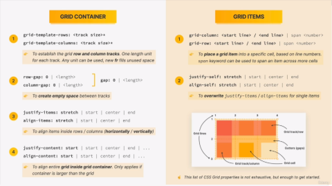
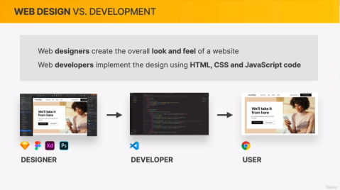
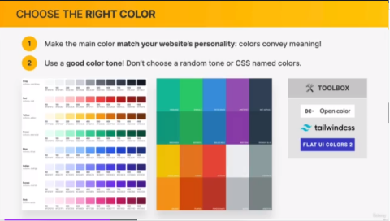
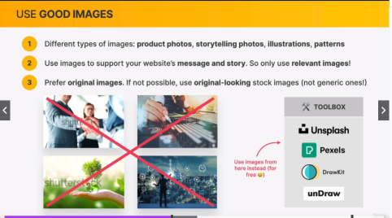
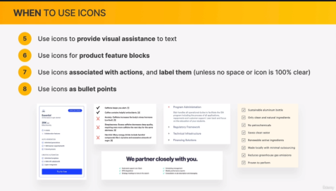

# Responsive Website with HTML5 & CSS3

#### Overall Overview

> **Web design**

> **HTML**

> **CSS**

> **Responsive Design**

# Section 1: Welcome and First Step

#### Overview

- The 3 languages that the browsers understand are HTML, CSS & JS
- **Front End Development** - the process of writing then displayed to the browser (will learn in this course !!!)
  - **Static Website** - where files are simply sent to the browser as they are. Files are already done.
- **Back End Development** - the invisible part of the website (website back end)
  - developers use back end language that run on servers ex. **nodejs** , **php** & **python**
  - **Dynamic Website** - website is dynamically assembled on the server (happens when someone visits the website). Need to be generated first by an application that is running in the server.
- **HTML** [nouns] - responsible for the content of the page. Text, ings, btns. always written in html files
- **CSS** [adj]- responsible for the presentation of that content, basically for styling and layouting
- **JS** [verb]- actual programming languange of frontend | dynamic effects to web pages | use to manipulate the content or css to load data from web server and even build entire frontend application aka web application
  

### Setting up code editor

> extension : prettier & one monokai theme

> default formatter: set prettier extension

> format on save: check box

> auto save: onFocusChange

> tab size : 2

### Downloading Course Material

> download the starter files and final code from the GitHub repo **https://github.com/jonasschmedtmann/html-css-course**

# Section 2: HTML Fundamentals

#### Overview

- **Intro to HTML**

  - HyperTextMarkupLanguage
  - Language that web developers use to structure and describe content (not programming language)
  - has different elements ex p, a href, h, img
  - web browser understand htm and render html code as websites

- **Elements** has 3 parts:

  - Opening tag: Name of the element warapped in < and >
  - Content: in text content another element (child element) and some has no content (e.g )
  - Closing tag: same with opening tag but has a / slash

- **Document Structure**

  ```
  *First Always declare Doctype: <!DOCTYPE html>
  ```

  ```
  *Second are Element:<html lang="eng"></html>

  lang - language
  ```

  ```
  *Followed by another element inside <html></html> element
    <head></head> -- invisible
    <meta charset="UTF-8" />
    -- metadata is data stands by data | UTF-8 stands for all special characters use in english
    <body></body> - visible
  ```

- **Text Elements**

  - headings : h1 - h6

    > h1 as the primary heading

  - strong elements : important elements in **html5** that needs to standout in the page [idea of sementic html]
    ```
    <strong> </strong>
    ```
  - emphasize : alternative for italic text for semantic html
    ```
    <em></em>
    ```
  - List : bullet form and by numbers
    ```
    for numbers:
    <ol>
      <li>The opening tag</li>
      <li>The closing tag</li>
      <li>The actual element</li>
    </ol>
    ```
    ```
    for bullet form: [w/o numbers]
    <ul>
    ```
  - Images: are special elementsand attributes: are pieces of data which can use to describe elements

    ```
     

    src = attribute
    alt = alternative text
    ```

  - Hyperlink | Links : enable internet to be a world wide web

  > 2 categories

  1. Links that point to other pages within our website
     ```
     <a href ="blog.html" target="_blank">Blog</a>
     ```
  2. Links that point to outside of our website

     ```
     <p>
     You can learn more at the
     <a href="https://developer.mozilla.org/en-US/docs/Web/HTML" target="_blank">
       MDN Web Docs.</a
     >. </p>

     target = open link to another windows tab
     ```

  - Structuring Page
    > Container elements - group the elements together

  ```
   <nav></nav>
   <header></header>
   <article></article>
  ```

  - Semantic HTML
    > semantic - certain elements has a meaning or purpose attach to them
  - using semantic:

  * search engine optimazation

  ```
  <strong></strong>
  <em></em>
  ```

  - Installing additional VS code

    > image preview

    > Color highlight - helpful in css

    > auto rename tag

    > Live Server

  - Challenge 1
    ```
    <aside></aside> - use for secondary information
    ```
  - Challenge 2
    > codepen.io

# Section 3: CSS Fundamentals

#### Overview

- **Casacading Style Sheet**
  

  > second language of the web, CSS

  > styling the content [visual style and presentation of the html content]

  > one core technology of the web

- Inline, Internal and External CSS

  - Inline - writing inside essentially of an element

    ```
    <h1 style="color: blue">📘 The Code Magazine</h1>
    ```

  - Internal - declare style in the head area

    ```
    <head>
    <meta charset="UTF-8" />
    <title>The Basic Language of the Web: HTML</title>

    <style>
      h1 {
        color: aqua;
      }
    </style>
    </head>
    ```

  - External - seperate file for all the style css
    ```
    <link href="style.css" rel="stylesheet" />
    ```

- Styling Text
  - has 6 categories
    ```
    h1 {
      color: blue;
      font-size: 26px;
      font-family: sans-serif;
      text-transform: uppercase;
      font-style: italic;
      text-align: center;
    }
    ```
- Combining Selectors

  - one or more selectors together

    ```
    h1,
    h2,
    h3,
    h4,
    p,
    li {
      font-family: sans-serif;
    }
    -----------------
    footer p {
    font-size: 16px;}
    -----------------
    article header p {
    font-style: italic;
    }
    ```

- Class and ID Selectors

  > id - uses hashtag (#)

  ```
  <p id="author">
        Posted by <strong>Laura Jones</strong> on Monday, June 21st 2027
      </p>
  ---------------
  #author {
  font-style: italic;
  font-size: 18px;
  }
  ```

  > class - uses dot (.) | can be uses for multiple elemets with same names

  ```
  <p class="related-author">By Jonas Schmedtmann</p>
  --------------------------------------------------
  .related-author {
  font-size: 18px;
  font-weight: bold;
  }
  ```

- Working with Colors

  - RGB Model

    > every color can be represented by a combination of RED, GREEN and BLUE

    > each of the 3 base colors can take a value between 0 and 255, which leads to 16.8 million different colors

    

  - Defining Colors in CSS

    > RGB / RGBA Notation

    ```
    Regular RGB model - rgb (0, 255, 255)
    ------------------------------------
    RGBA (with transparency of alpha) - rgba (0, 255, 255, 0.3)

    ```

    > Hexadecimal Notation - Instead of using scale from 0 to 255, go with 0 to ff (255 in hexadecimal numbers)

    ```
    #00ffff
    -------
    ff is same with 255 in a hexidecimal scale
    -------
    hexidecimal numbers do not go from 0 to 9 but from 0 to 15
    ```

    - shorthand - when all colors are identical pairs

    ```
    #0ff
    ```

    - In practice, mostly used hexadecimal colors and rgba when we need transparency

  - Shades of Grey

    > when colors in all 3 channels are the same

    > there are 256 pure grays to choose from

    

    - border
      ```
      border: 5px solid #1098ad;
      --------------------------
      size : style : color
      ```

- Pseudo Classes

  > keyword addes to a selector that specifies a special state of selected elements

  ```
  li:first-child {
  font-weight: bold;
  }

  li:last-child {
    font-style: italic;
  }

  li:nth-child(2) {
    color: red;
  }

  li:nth-child(odd) {
    color: red;
  }
  --------------------
  article p:last-child {
  color: red;
  }
  ```

- Styling Hyperlinks (using pseudo classes)

  > **LVHA** (Link, Visited, Hover, Active)

  ```
    a:link {
  color: #1098ad;
  text-decoration: none;
    }

    a:visited {
      color: #1098ad;
    }

    a:hover {
      color: orangered;
      font-weight: bold;
      text-decoration: underline orangered;
    }

    a:active {
      background-color: black;
      font-style: italic;
    }
  ```

- Using Chrome Devtools

  - Inspect in google chrome

  - Developer tools
    > usually the h1 is in bold style due to default style in user agent stylesheet

- CSS Theory #1: Conflicts Between Selectors
  

  - Solutions
    

    > when there is multiple declarations, selectors matters.

    > Inline style have a higher priority than ID selectors

    > Has important keyword [! important] is the highest priority

    ```
      footer p {
        color: green !important;
      }
    ```

- CSS Theory #2: Inheritance and the Universal Selector

  - Inheritance - mechanism by which some styles ; some properties inherited from parents elements to child elements

    > body is the parent of all elements

    > inherited are the ones who have the lowest priority for those elements who override

    

  - Universal Selector - use to style all the elements
    ```
      * {
    border-top: 10px solid #1098ad;
      }
    ```

- Challenge 1 - done

- CSS Theory #3: The CSS Box Model

  > describe how the element displayed on the webpage and how they are size:

  

  - Analogy
    

  - Element width and height calculation
    

- Using Margins and Paddings

  > global reset - use to make customation easier

  ```
  * {
  margin: 0;
  padding: 0;
  }
  ```

  > collapsing margin - basically when we have two margins that occupied the same space, only one of them is visibl in the page, usually the larger.

  > Note: whenever you need some space inside of an element, mostly when have a background color or border, use padding. While in order to create outside of an element, or between multiple elements always use margin

  > when add vertical spaces, always use margin bottom.

- Adding Dimension

  > when no property declare, automatically auto

  ```
    .post-img {
  width: 800px;
  height: auto;
  --------------
  .post-img {
  width: 100%;
  height: auto;
  }
  }

  % will be same with parent container
  ```

- Centering our Page

  > Trick - put all elements in a container

  > add some margin left into the right of container

  ```
    margin: 0 auto;
  ```

- CSS Theory #4: Types of Boxes

  > Inline Boxes - only occupies exactly the spaces that is needed for its content [single element] > 
  > Block level elements or boxes - occupies all space that they can and they basically create line breaks after them. Cannot side by side by one another.
  >  > \*\*\* Note: Can text-align to center if its in block element

  > Combination (Inlink-block boxes)
  > 

- CSS Theory #5: Absolute Positioning
  

  > Note: basically put any element that you want, wherever you want it to be on the page. We use absolute positioning for single elements.

- Pseudo - Elements

  > are essentially elements that dont exist in HTML but we can still select and design in css

  ```
  :: - use in pseudo elements
  ---------------------------

  h1::first-letter {
  font-style: normal;
  margin-right: 5px;
  }
  ```

  > adjacent selector / adjacent sibling selector - basically an element that is part of the same element.
  > Is a sibling that is actually the very next element.

        ```
        h3 + p::first-line {

        color: red;
        }

        ***

        plus sign (+) is for adjacent sibling

        ```

  > After and Before Pseudo elements

  ```
  After Pseudo element create a pseudo element that will automatically be the very first child of the selected elemets

  h2::after {
  content: "TOP";
  background-color: #ffe70e;
  color: #444;
  font-size: 16px;
  font-weight: bold;
  display: inline-block;
  padding: 5px 10px;

  position: absolute;
  top: -10px;
  right: -25px;
  }

  ***after will basically become the very last child, while before is the very first child
  ***when positioning in absolute, after and before will be the same output
  *** after and before are inline elements
  ```

- #Developer Skill #1: Googling and Reading Documentation

  > usually look to stackoverflow

  > CSS-Tricks [also very good]

  > developer.mozilla.org - actually the MDN Documentation

- #Developer Skill #2: Debugging and Asking Question

  > use an HTML validator tool

  ```
  1st: Copy all  the code
  2nd: Google, HTML Validator
  3rd: Directly put copy codes in Direct Input option
  ```

  > use a Diff checker - can be very helpful to compare your own code

# Section 4: Building Layouts

- The 3 ways of Building Layout

  > the way text and other content that is arranged in the website
  > 

  - 2 Types of Layout
    

    > Page Layout - laying out of the element (big pieces of content inside webpage)

    > Component Layout - bigger page layouts that are made of components (basically made of smaller pieces of content)

  - 3 Ways to Build Layout

    > Float Layout - using float CSS property (replaced by )

    > Flexbox - modern ways of laying out elements. Perfect for building one dimensional layouts (component layout)

    > CSS Grid - can build complete two dimensional layout. Perfect for page layout and complex components

    

  - Using Float
    

    ```
    .author {
    padding-left: 80px;
    padding-top: 10px;
    float: right;
    }

    .author-img {
    float: left;
    }
    ```

- Clearing Floats (only works in a block level element)

  > Collapsed Height - simple add another elements and clear the float

  ```
  <header class="main-header class="clear">

  .clear {
  clear: both;
  }

  ```

  > Clearfix hack - avoid empty elements also work on collapsed height

  ```
   create after pseudo element in css to create a new element will be the less child in the container

    <header class="main-header clearfix">

    .clearfix::after {
  clear: both;
  content: "";
  display: block;
  }


  ```

- Building a Simple FLoat Layout

  ```

    /* Building simple float layout */
  article {
    /* background-color: green; */
    width: 825px;
    float: left;
  }

  aside {
    /* background-color: red; */
    width: 300px;
    float: right;
  }

  footer {
    /* background-color: yellow; */
    clear: both;
  }

  ```

- Box Sizing : Border - box

  > Is the element would simply be exactly that size, no matter what border or padding? Yes, by simply use a property of:

  Note: not put in the body property because box sizing is not the one of getting inherited, instead in universal selector

  ```
  box-sizing: border-box;
  ```

  

- Challenge #1

  ```
    (825 - 8 - 250 - 80 = Total / 2 for boxes)

    825 (container total width)
    8 (total sides)
    80 (total space between declare for 40)
    250 (width of pic)
  ```

- Flexbox

  > so-called flex items because they are the child element of the flex a container.

  > horizontally - each elements takes up exactly the space that is necessary for its text content

  > vertically - by default, all the flex items are as tall as the tallest element

  ```
        display: flex;
        align-items: center;
        justify-content: space-between;
    ---------------
    important application to use:
    align-items: center;
  ```

#### Overview: Flexbox

    - 

> Terminology
> 

> 

- Spacing and Aligning Flex Items

  ```
    .el {
        margin-right: 30px;
      }

      .el--1 {
        align-self: flex-start;
      }

      .el--5 {
        align-self: stretch;
        order: 1;
      }

      .el--6 {
        order: -1;
      }
  ```

- The Flex Property

  ```
  default

  flex-grow: 0;
  flex-shrink: 1;
  flex-basis: auto;

  -----------------
  flex: 0 0 200px;
  ```

  > if there is not enough space in a container
  > to fit the items with the size that we described here using flex basis,then Flexbox is allowed to shrink these items by default because flex shrink is set to one.However, if we want to change that,which sometimes we might want,then we can simply set this to zero.

- Introduction to CSS Grid

  > the most modern way of building layouts and also the most complete one.

  > can also use gap, never margin

  > using fr unit allow us to very easily create flexible columns and rows

  #### Overview

  > 

  - Terminology
    

    

    

  ```
     display: grid;
        grid-template-columns: 200px 200px 1fr 1fr;
        grid-template-columns: 3fr 1fr 1fr auto;
        grid-template-rows: 300px 200px;
        grid-template-columns: repeat(4, 1fr);
        grid-template-rows: 1fr 1fr;
        height: 500px;
        gap: 30px;
        column-gap: 30px;
        row-gap: 60px;
  ```

  - Placing and Spaning Grid Items

    ```

        .el--8 {
          grid-column: 2 / 3;
          grid-row: 1 / 2;
        }

        .el--2 {
          /* grid-column: 1 / 4;
          grid-column: 1 / span 3; */
          grid-column: 1 / -1;
          grid-row: 2;
        }

    ```

  - Aligning Grid Items and Tracks

    ```
        /* ALIGNING TRACKS INSIDE CONTAINER: distributing empty space */
        justify-content: center;
        align-content: center;

        /* Aligning the tracks: aligning the items inside cells: moving items around inside cells */
        align-items: end;
        justify-items: end;
    ```

# Section 5: Web Design Framework

#### Overview




#### Ingredients

- Web Design Rules #1: TYPOGRAPHY

  > "Typography is the art and technique of arranging type to make written language legible, readable and appealing when displayed" -Wikipedia

  
  
  
  

  

- Implementing Typography

  > use type scale and space scale system for better guidelines.

  ```
  font-size: 16px; (default)
  letter-spacing: normal, 1px:
  line-heigt: 1.5;
  ```

- Web Design Rules #2: COLORS
  
  
  
  
  

- Web Design Rules #3: IMAGES & ILLUSTRATIONS
  
  
  
  

- Web Design Rules #4: ICONS
  
  
  
  
  

  ```
  heroicons.com
  ```

- Web Design Rules #5: SHADOWS
  
  
  
  

- Web Design Rules #6: BORDER-RADIUS
  
  

- Web Design Rules #7: WHITESPACE
  
  
  
  

# Section 6: Components and Layouts

# Section 7: Omnifood: Desktop

# Section 8: Omnifood: Responsive

# Section 9: Omnifood: Optimazations
